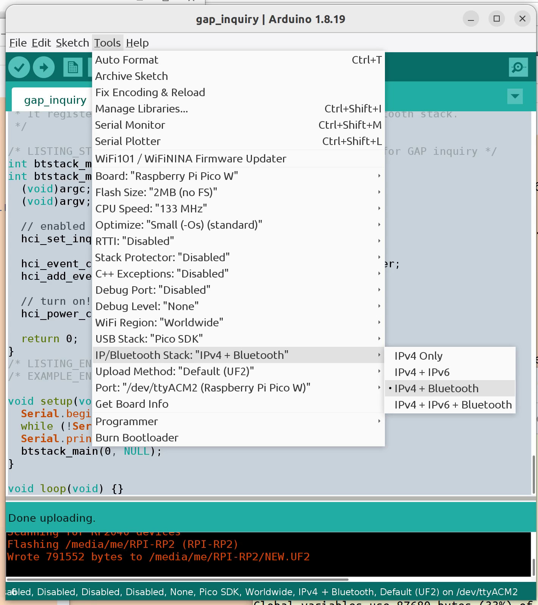

# Raspberry Pi Pico W Bluetooth Examples for Arduino IDE

Various BlueKitchen BTstack examples from
https://github.com/bluekitchen/btstack/tree/72ef1732c954d938091467961e41f4aa9b976b34/example
with minimal modifications to work with the Arduino IDE.

The examples listed as NEW are not direct ports of BTstack examples. They may
be combinations of two or more examples.

## gap_inquiry.ino

Discover BT classic devices. The devices must be discoverable which is true
when the devices are in pairing mode.

Sample output
```
Starting inquiry scan..
Device found: xx:xx:xx:xx:xx:xx with COD: 0x002540, pageScan 1, clock offset 0x57c6, rssi -63 dBm
Get remote name of 21:31:80:DE:A3:57...
Name: 'Bluetooth 5.1 Keyboard'
Staring inquiry scan..
Device found: xx:xx:xx:xx:xx:xx with COD: 0x000580, pageScan 1, clock offset 0x2f38, rssi -43 dBm, name 'BT3.0 Mouse'
```

## gap_le_advertisements.ino

Scan for BLE advertisements. The devices must be sending advertisements which
is true when the devices are in pairing mode.

Sample output
```
Advertisement (legacy) event: evt-type 4, addr-type 1, addr xx:xx:xx:xx:xx:xx, rssi -60, data[27]     Complete Local Name: Microsoft Bluetooth Mouse

Advertisement (legacy) event: evt-type 0, addr-type 1, addr xx:xx:xx:xx:xx:xx, rssi -55, data[18]     Appearance: 3C2
    Flags: LE General Discoverable Mode; BR/EDR Not Supported;
    Complete List of 16-bit Service Class UUIDs: 1812

Advertisement (legacy) event: evt-type 4, addr-type 1, addr xx:xx:xx:xx:xx:xx, rssi -44, data[0]
Advertisement (legacy) event: evt-type 0, addr-type 1, addr xx:xx:xx:xx:xx:xx, rssi -44, data[31]     Flags: LE Limited Discoverable Mode; BR/EDR Not Supported;
    Complete List of 16-bit Service Class UUIDs: 1812
    Appearance: 3C2

    Complete Local Name: BT5.0 Mouse

Advertisement (legacy) event: evt-type 4, addr-type 0, addr xx:xx:xx:xx:xx:xx, rssi -55, data[26]     Complete Local Name: Xbox Wireless Controller

Advertisement (legacy) event: evt-type 0, addr-type 0, addr xx:xx:xx:xx:xx:xx, rssi -58, data[19]     Flags: LE General Discoverable Mode; BR/EDR Not Supported;
    Tx Power Level: 20 dBm
    Appearance: 3C4

    Complete List of 16-bit Service Class UUIDs: 1812
```

## hog_host_demo.ino

HOG = HID over GATT therefore BLE.

Scan for BLE HID devices, pair, connect, then dump HID reports.

```
14:38:02.604 -> Scanning for LE HID devices...
14:38:19.885 -> Found, connect to device with random address xx:xx:xx:xx:xx:xx ...
14:38:20.017 -> Just works requested
14:38:20.315 -> Pairing complete, success
14:38:20.315 -> Search for HID service.
14:38:22.037 -> HID service client connected, found 1 services
14:38:22.037 -> Ready - please start typing or mousing..
14:38:24.156 -> 01,03,00,00,00,00,00,00,00,00,
14:38:24.156 -> usage_page 9, usage 1, value 1
14:38:24.156 -> usage_page 9, usage 2, value 1
14:38:24.156 -> usage_page 9, usage 3, value 0
14:38:24.156 -> usage_page 9, usage 4, value 0
14:38:24.156 -> usage_page 9, usage 5, value 0
14:38:24.156 -> usage_page 1, usage 30, value 0
14:38:24.156 -> usage_page 1, usage 31, value 0
14:38:24.156 -> usage_page 1, usage 38, value 0
14:38:24.156 -> usage_page c, usage 238, value 0
```

## gap_dual.ino NEW

This combines the gap_inquiry and gap_le_advertisements examples so will
display classic and BLE devices in pairing mode.

## Arduino IDE Board Setup

The examples are built with https://github.com/earlephilhower/arduino-pico.

Reference: https://arduino-pico.readthedocs.io/en/latest/bluetooth.html#writing-custom-bluetooth-applications

Be sure to set the "IP/Bluetooth Stack" option to include Bluetooth.


